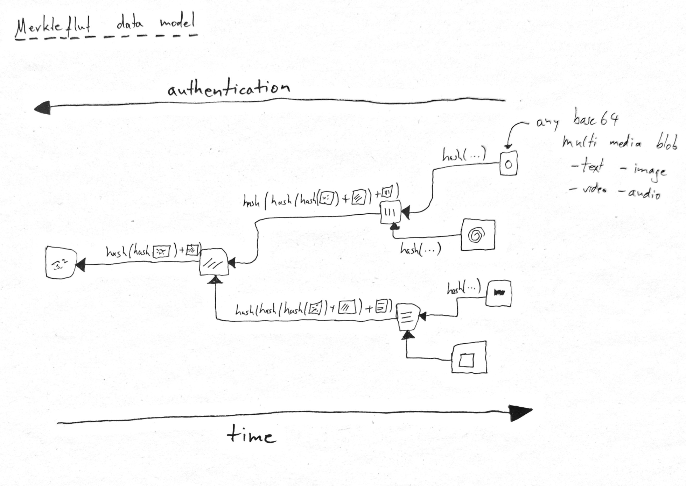

# merkleflut

> Merkle-flut is a generative multi-medial storytelling machine.

## installation

```bash
$ npm i
$ npm dev
```

## system design

### data model

merkleflut uses a hash tree to authenticate stored data. The diagram shows that within a branch's story, time flows towards the leaves, while authentication can only be verified towards the root. Theoretically, there's no contraint on the data a tree node can hold. A convention of e.g. encoding all data canonically into base64 would makes sense though, as then - apart from text - also video, audio and images can be ingested.



## further documentation

see documents directory.

## license

see LICENSE file.
